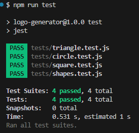

# Logo-Generator

Logo-Generator is a command-line application tool enabling users to craft personalized SVG logos by inputting details like file name, text, text color, shape, and shape color. It then creates an SVG file with the given name, incorporating the user's specifications. The application further showcases the generated logo once opened in a web browser.

- The application prompts users to input values for various parameters including text, text color, shape, and shape color.

- The application supports both color keywords and hexadecimal numbers for specifying colors.

- The application offers a selection of shapes to choose from. including  a circle, triangle, and square.

## Installation

To install Employee Tracker:

- Clone the repository: https://github.com/Justino11247/Logo-Generator

- Go to the project directory

- Launch the terminal and execute `npm install`

## Usage

<ol>
  <li>To run the application:</li>
    <ul>
      <li>Run the prompt: npm start</li>
      <li>Complete the prompt shown.</li><li>Once the prompt is completed, find the svg file in the examples folder and open it in a browser to see your logo!</li>
    </ul>
    
    
  <li>To run the tests</li>
    <ul>
      <li>Run the prompt: npm run test</li>
    </ul>
</ol>

[Link to Walk Through Video]

 

 

 

 

